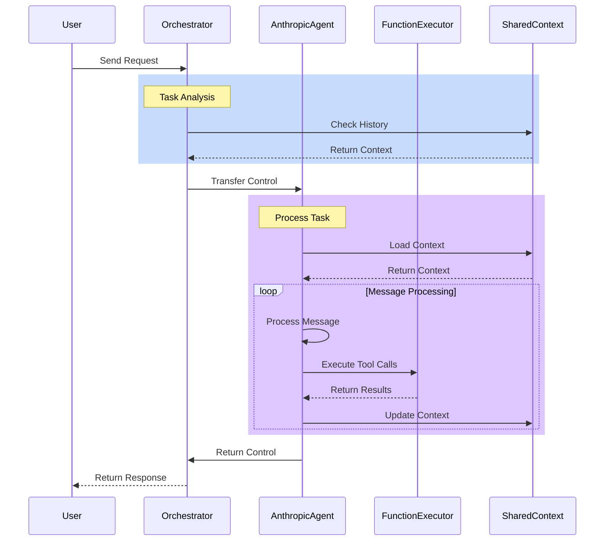

# Multi-Agent System Architecture

## System Components

1. **Orchestrator**
   - Handles initial request routing
   - Manages agent selection and control flow
   - Maintains system coordination

2. **AnthropicAgent**
   - Based on Claude-3 model
   - Processes messages and generates responses
   - Executes tool calls through function executor
   - Maintains conversation memory

3. **Function Executor**
   - Handles tool execution
   - Processes function calls from agents
   - Returns results to the calling agent

4. **Shared Context**
   - Maintains system state
   - Stores conversation history
   - Provides context for agent decisions

## Message Flow

1. **Request Handling**
   - User initiates request to Orchestrator
   - Orchestrator analyzes task and context
   - Control transferred to appropriate agent

2. **Message Processing**
   - Agent receives message with context
   - Processes using Claude-3 model
   - Generates text responses and/or tool calls
   - Updates shared context with results

3. **Tool Execution**
   - Tools defined using function schemas
   - Agent makes tool calls as needed
   - Results integrated into response
   - Context updated with execution results

## Implementation Details

1. **Agent Configuration**
   - Initialized with name and instructions
   - Configured with specific model (e.g., claude-3-sonnet)
   - Tool schemas provided for function execution

2. **Message Handling**
   - Messages processed in conversation format
   - Responses include text and tool calls
   - Tool calls executed through function executor
   - Results maintained in agent memory

3. **Tool Integration**
   - Tools defined using Anthropic schema format
   - Function calls tracked and validated
   - Results integrated into response flow
   - Context updated after execution

4. **State Management**
   - Conversation history maintained
   - Tool execution results preserved
   - Context shared across interactions
   - Memory persisted for continuity

## Extension Points

- Additional agent types can be implemented
- New tools can be added via function schemas
- Context sharing protocols can be enhanced
- Memory management can be customized
