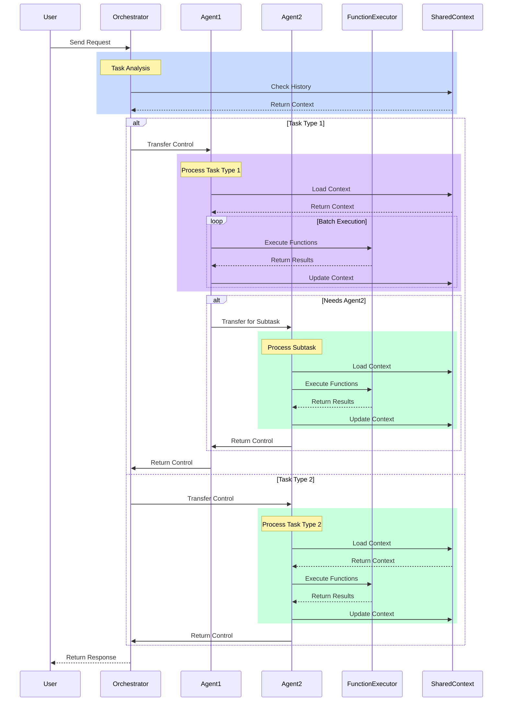

# Multi-Agent System Architecture

## System Flow Example

1. **Initial Request Handling**
   - User sends request to Orchestrator
   - Orchestrator analyzes task type and context
   - Decides whether to route to Agent1 or Agent2

2. **Agent Interaction Patterns**
   - **Pattern 1: Direct Processing**
     * Orchestrator → Agent2 → Orchestrator
     * Used for simple, single-agent tasks
   
   - **Pattern 2: Agent Collaboration**
     * Orchestrator → Agent1 → Agent2 → Agent1 → Orchestrator
     * Used for complex tasks requiring multiple agents

3. **Context Management**
   - SharedContext maintains system state
   - All agents access the same context
   - History tracked across agent transfers

4. **Function Execution**
   - Agents can execute functions in batches
   - Results update shared context
   - State maintained throughout process

## Implementation Notes

- **Agent1 Example**: Could handle complex tasks requiring batch processing
- **Agent2 Example**: Could handle simpler, single-function tasks
- Both agents follow same context-sharing protocol
- System can be extended with more agents following these patterns
